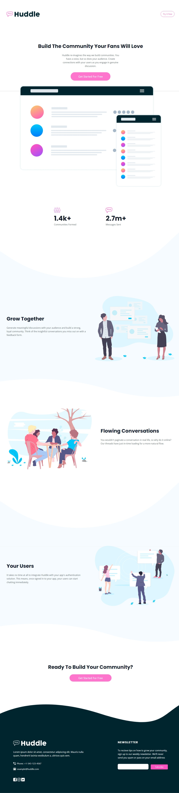

# Frontend Mentor - Huddle landing page with curved sections solution

This is a solution to the [Huddle landing page with curved sections challenge on Frontend Mentor](https://www.frontendmentor.io/challenges/huddle-landing-page-with-curved-sections-5ca5ecd01e82137ec91a50f2). Frontend Mentor challenges help you improve your coding skills by building realistic projects. 

## Table of contents

- [Overview](#overview)
  - [The challenge](#the-challenge)
  - [Screenshot](#screenshot)
  - [Links](#links)
- [My process](#my-process)
  - [Built with](#built-with)
  - [What I learned](#what-i-learned)
  - [Continued development](#continued-development)
  - [Useful resources](#useful-resources)
- [Author](#author)
- [Acknowledgments](#acknowledgments)


## Overview

### The challenge

Users should be able to:

- View the optimal layout for the site depending on their device's screen size
- See hover states for all interactive elements on the page

### Screenshot




### Links

- Solution URL: [Add solution URL here]([https://your-solution-url.com](https://www.frontendmentor.io/solutions/responsive-huddle-landing-page-using-tailwind-css-and-html-1IjB80GIg6))
- Live Site URL: [Add live site URL here]([https://your-live-site-url.com](https://ahmad-qarany-farhan-huddle-landing-pa.netlify.app/))

## My process

### Built with

- Semantic HTML5 markup
- CSS custom properties
- CSS Grid


### What I learned

The following are some of what I learned throughout my journey.

```html

```
```css
.attribution {
    font-size: 11px;
    text-align: center;
}
```


### Continued development

I wasn't completely comfortable with the responsiveness of my page as well as in the footer section I need to improve the icons when hovering.

### Useful resources

- [Tailwind website](https://tailwindcss.com/) - This helped me a lot when writing the Tailwind code and explained things very simply.forward.
- [W3school website](https://w3schools.com/) - This is one of the most popular websites that is very helpful in writing HTML and CSS.


## Author

- Website - [Ahmad Qarany Farhan](https://ahmadqaranyfarhan.github.io/)
- Frontend Mentor - [@ahmadqaranyfarhan](https://www.frontendmentor.io/profile/ahmadqaranyfarhan)
- Twitter - [@AhmadQarany](https://twitter.com/AhmadQarany)


## Acknowledgments

First of all, I thank God and then my family who helped me a lot in providing a favorable environment for me to complete my project comfortably, Then I want to thank the [Recorded community](https://www.re-coded.com/) and my trainers who have worked hard with me to learn also in that community I want to thank [Elaf Gardi](https://github.com/Elaf-Gardi) because I used her code in some places in my project, also many thanks for YouTuber [Thomas Sankara](https://www.youtube.com/@tsbsankara) which his tutorial videos have been useful to me.
